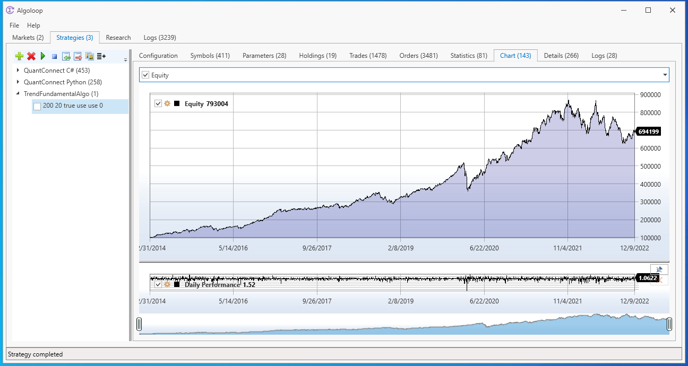

Algoloop trading application
=========

 
Install prebuilt software and [get started](https://github.com/Capnode/Algoloop/wiki/Getting-started).

## Introduction ##
Algoloop is an open-source algorithmic trading application with a Windows desktop frontend to QuantConnect Lean trading engine. 
- Local algorithm backtest execution
- Algorithms in C# and Python
- Algorithm optimization
- Market data from multiple providers
- Windows desktop user interface

## Information ##
More information and user documentation can be found [here](https://github.com/Capnode/Algoloop/wiki).

## Contribution ##
Contributions are welcome:
- Live trading execution
- Full integration with QuantConnect web services
- ...

## Contact ##
info@capnode.com
