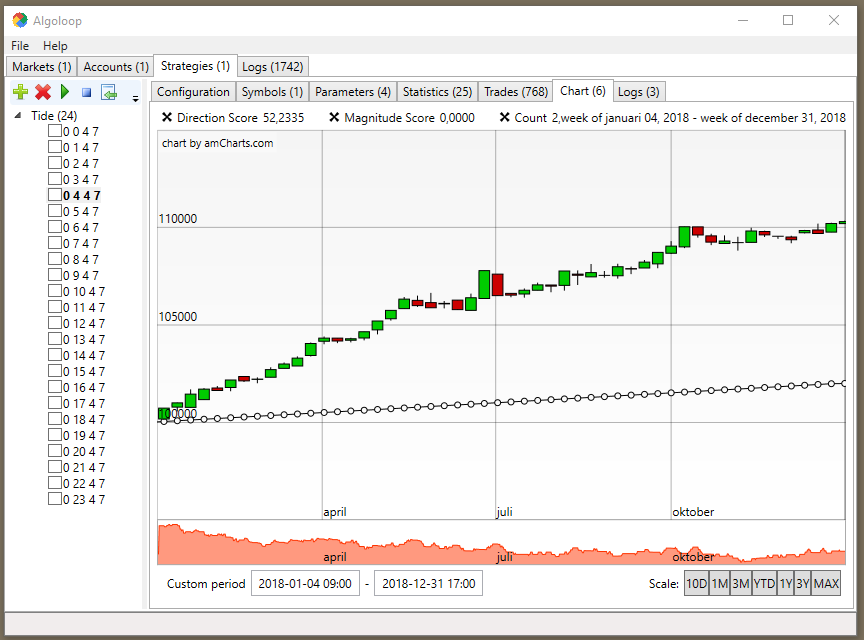
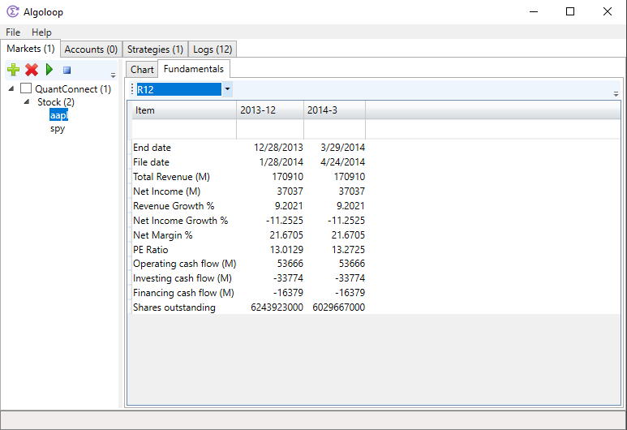
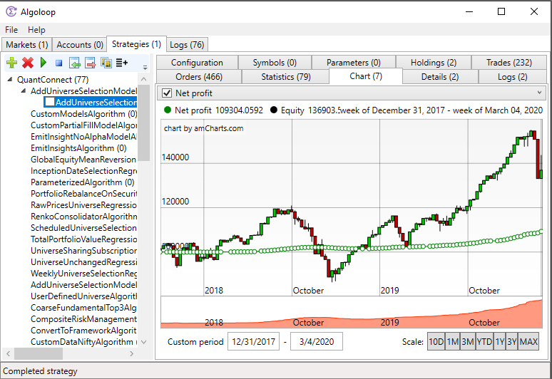
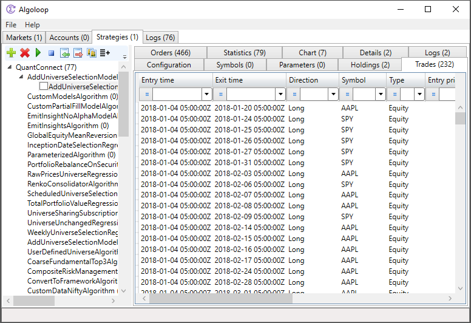

Algoloop trading application
=========

## Introduction ##
Algoloop is an open-source algorithmic trading application with a Windows desktop frontend to QuantConnect Lean trading engine. 
- Local live execution with multiple brokerages
- Local algorithm backtest execution
- Algorithms in C# and Python
- Algorithm optimization
- Market data from multiple providers
- Windows WPF user interface

For full documentation of QuantConnect Lean trading engine, please see https://www.quantconnect.com/lean

## Contribution ##
Contributions are welcome:
- Finding bugs
- Fixing bugs
- Improved charting package that can replace amCharts
- Python support
- Full integration with QuantConnect web services
- ...

## Screenshot ##

## Contact ##
info@capnode.com
