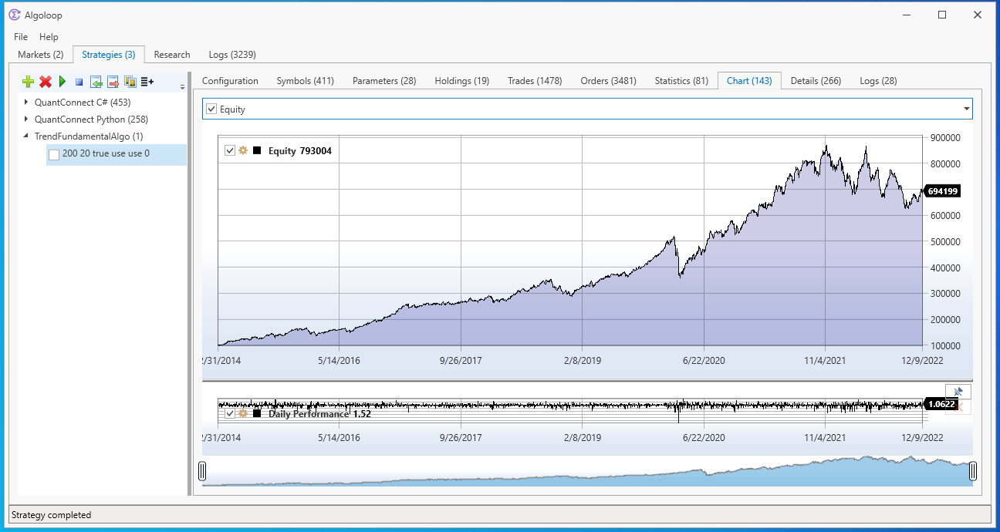

Algoloop trading application
=========

<a href='//www.microsoft.com/store/apps/9PGZD6RCG6LC?cid=storebadge&ocid=badge'></a><br>
Install prebuilt software and [get started](https://github.com/Capnode/Algoloop/wiki/Getting-started).

## Introduction ##
Algoloop is an open-source algorithmic trading application with desktop frontend to QuantConnect Lean trading engine. 
- Local algorithm backtest execution
- Algorithms in C# and Python
- Algorithm optimization
- Market data from multiple providers
- **Windows desktop user interface (WPF)**
- **Cross-platform user interface (Avalonia UI)** - NEW! ✨



## Cross-Platform Support (Avalonia UI) ##

A new **Avalonia UI** version is now available for cross-platform support:

### Building the Avalonia Version
```bash
# Prerequisites: .NET 8.0 SDK

# Build
dotnet build Algoloop.Avalonia/Algoloop.Avalonia.csproj

# Run
dotnet run --project Algoloop.Avalonia/Algoloop.Avalonia.csproj
```

### Platform Support
- ✅ Windows (10/11)
- ✅ Linux (X11/Wayland)
- ✅ macOS (10.13+)

**Note**: The Avalonia version is under active development. See [AVALONIA_MIGRATION.md](AVALONIA_MIGRATION.md) for migration status and technical details.

## Information ##
More information and user documentation can be found [here](https://github.com/Capnode/Algoloop/wiki).

## Contribution ##
Contributions are welcome:
- Live trading execution
- Full integration with QuantConnect web services
- Avalonia UI feature completion
- ...

## Contact ##
info@capnode.com
